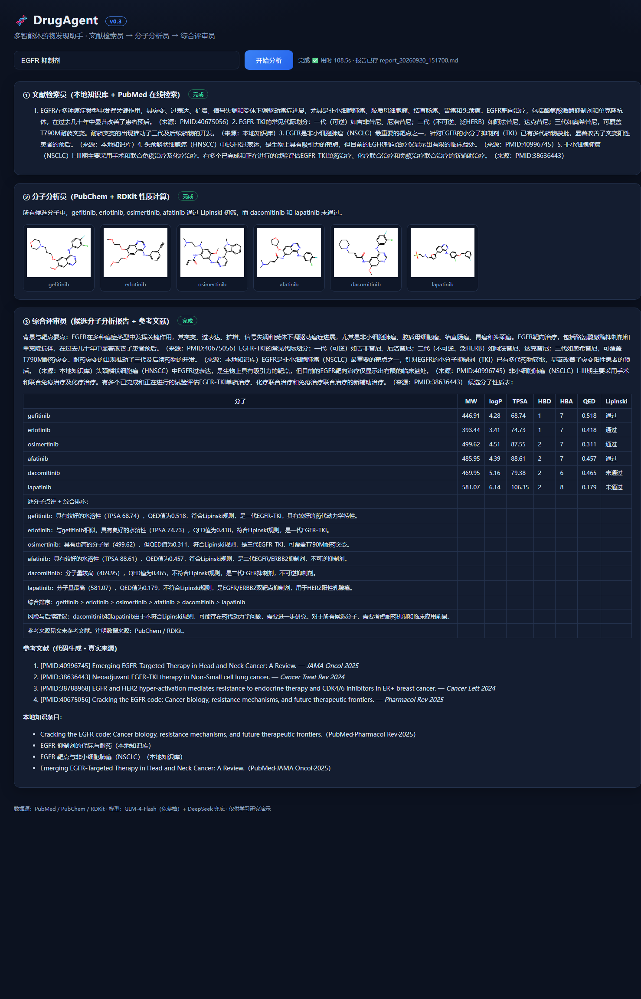

# DrugAgent · 多智能体药物发现助手（v0.3）

一个「多智能体药物发现」原型：**文献检索员 + 分子分析员 + 综合评审员** 三个 LLM 智能体通过共享黑板协作，输入一个靶点/主题，输出一份带**真实数据与文献引用**的候选分子分析报告。命令行 + 网页版双入口。

## 现在能做什么（v0.3）

- 🔍 **文献检索员**
  - **本地知识库语义检索**（GLM embedding-3 向量检索，失败自动回退 BM25）
  - **PubMed 在线检索**：E-utilities 公开接口，抓真实论文摘要，**结果自动缓存**进本地知识库（越用越强）
- 🧪 **分子分析员**：从 **PubChem** 拉取候选分子 SMILES（真实数据），用 **RDKit** 计算 MW / logP / TPSA / HBD / HBA / QED，做 **Lipinski 初筛**
- 🧾 **综合评审员**：融合文献与分子数据，生成中文《候选分子分析报告》（背景 / 性质表 / 逐分子点评+排序 / 风险建议 / **参考来源含 PMID**）
  - 性质表由**代码直接生成**、模型原样嵌入 —— 数据零转手、零误差
- 🖥 全程可追踪：每个智能体的工具调用实时打点；报告自动存到 `reports/`
- 🌐 **网页版演示（v0.3 新增）**：一键启动，SSE 实时进度、RDKit 分子结构图、报告在线 Markdown 渲染

## 快速开始

```bash
cd D:/work/drugagent
.venv\Scripts\python.exe run.py "EGFR 抑制剂"
```

> 双工具：Windows 双击 `run_demo.bat` 也可以。
> 依赖：`openai` / `rdkit` / `requests` / `rich` / `fastapi` / `uvicorn`（已装进本项目 .venv）
> 模型：默认智谱 `glm-4-flash`（免费档）+ `embedding-3`，失败自动回退 DeepSeek；key 从 `D:/Hermes/.env` 读取。

## 网页版演示

```bash
# 双击 start_web.bat，或：
.venv\Scripts\python.exe web.py     # → http://127.0.0.1:8077
```

输入靶点、点击「开始分析」：三智能体的实时进度、分子结构图与最终报告会在页面上逐步呈现。



## 架构

```
用户问题 ─→ 编排器（黑板状态）
              ├─ 文献检索员  ←→ search_local（语义检索：语料+论文缓存）
              │              ←→ search_pubmed（PubMed 在线 → 自动缓存）
              ├─ 分子分析员  ←→ analyze_molecules（PubChem + RDKit）
              └─ 综合评审员  ←→ 汇总输出报告（reports/*.md，含 PMID 引用）
```

文件结构：

```
drugagent/
├─ run.py             # 命令行入口
├─ web.py             # 网页版入口（FastAPI + SSE + RDKit 结构图）
├─ agents.py          # Agent（JSON 工具协议）+ Team（编排器）
├─ llm.py             # LLM 客户端（多 provider 回退 + embedding）
├─ config.py          # 读 key / provider 配置
├─ check_webui.py     # 无头 Edge + CDP 端到端验证（开发工具，产出 docs/ 截图）
├─ tools/
│  ├─ retriever.py    # 语义检索器（embedding-3 / BM25 回退，向量磁盘缓存）
│  ├─ molecules.py    # PubChem + RDKit
│  └─ literature.py   # 本地知识库检索 + PubMed 在线检索/缓存
├─ web/
│  └─ index.html      # 前端单页（SSE + 报告渲染 + 结构图网格；marked 已本地化）
└─ data/
   ├─ corpus.json        # 内置知识语料（可替换为论文库）
   ├─ paper_cache.json   # PubMed 抓取的论文缓存（自动增长）
   ├─ embed_cache.json   # embedding 向量缓存
   └─ egfr_candidates.csv # 候选分子表（演示用）
```

## Roadmap

- [x] v0.1 命令行三智能体协作 + 真实数据（PubChem / RDKit）
- [x] v0.2 检索升级：语义检索（embedding-3）+ PubMed 在线检索 + 论文自动缓存
- [x] v0.3 网页版 UI：SSE 实时进度 + 分子结构图 + 报告在线渲染（附无头 Edge 验证脚本）
- [ ] v0.4 更丰富的工具：分子相似性搜索 / 对比实验模板 / 更多靶点候选集

> 仅用于学习与研究演示；数据来自 PubMed / PubChem / RDKit，不构成任何医疗建议。
